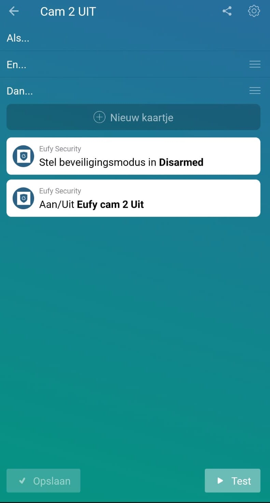

# Eufy Security

Add support for Eufy Cam in Homey.
Based on: https://github.com/JanLoebel/eufy-node-client

# Account Information

Because of the way the Eufy Security private API works, an email/password combo cannot
work with _both_ the Eufy Security mobile app _and_ this library. It is recommended to
use the mobile app to create a secondary "guest" account with a separate email address
and use it with this library.

# Usage
- Install this app on your Homey.
- Go to the app settings and provide your Username and Password. Click Save Changes
- Other keys will be fetched and filled in to the settings page.
- Connect a device to Eufy Security
- Create a flow with Eufy Security devices

## Current features:
- turn on/off camera (EufyCam pan&tilt will turn its lens)
- Set guard mode (Home, Away, Disarmed, Schedule)
- Add devices and use them in flows. (on/off)
- Get notifications based on detection modes for specific devices. (Motion, Face, Sound and Doorbell Press) 
- Get images when motion is detected

## To do:
- check 2FA
- check if the keypad is going to work
- [Feature Request] Preset response · Issue #2 · martijnpoppen/com.eufylife.security · GitHub
- Turn the eufy pan&tilt via Homey (e.g.: when you’re home turn 180 degrees to the wall)

---
&nbsp;
## Donation
If this project help you reduce time to develop, you can give me a cup of coffee :) 

&nbsp;

---
&nbsp;

